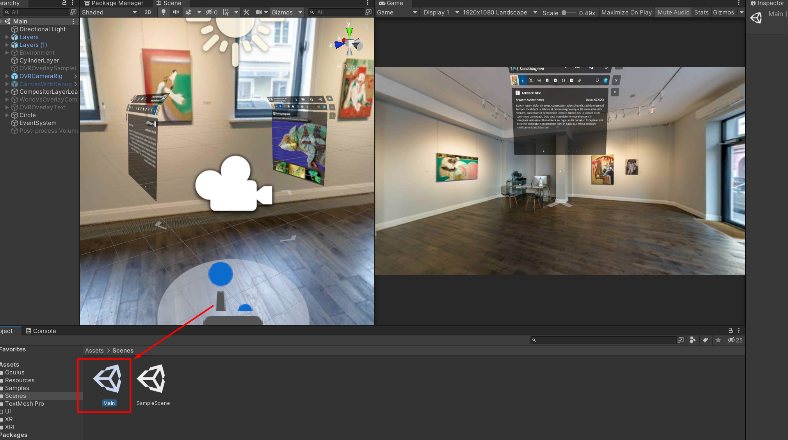

# 3rdi UI/UX Unity Demo

❗❗❗ **Important:** ❗❗❗

Unity version :`2021.1.6f1`
> No other version will do it.

## Links

- [MRTK official documentation](https://learn.microsoft.com/en-us/windows/mixed-reality/mrtk-unity/mrtk2/?view=mrtkunity-2022-05)

😎🤓👻
Oh No without Windows Terminal emoji dont work **OMG**

It's simple demo that allo to view current design using `Oculus Quest 2`

All necessary information can be found incide `Main.unity`

## Todo 

- [x] Make Web Page Design
- [x] Make App UI/UX Design
- [x] Make AR Quest 2 Build
- [ ] Understand 🤯 Git 
	> What do you think Yuriy I am not Big 🧠 like yout
- [ ] Explain to everyone how to use current build 

Date of publication:   

> Thu Sep 15 20:51:24 2022

Even More text
